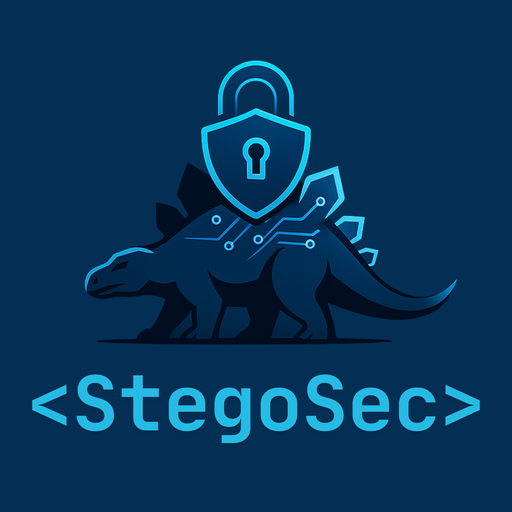

<div align="center">
  <br>
  <h1>StegoSec</h1>
  <p><em>Protección digital con enfoque técnico y estratégico.</em></p>

  <a href="https://github.com/stegosec">
    
  </a>
  <a href="#">
    
  </a>
</div>

---

## Bienvenido

StegoSec es una **empresa de ciberseguridad** especializada en **CTI**, **hardening** y **automatización de seguridad**. Desarrollamos productos (open-source y comerciales) y herramientas prácticas para equipos técnicos, con enfoque técnico y estratégico.

Este es el repositorio principal de la empresa, donde centralizamos enlaces a proyectos, documentación y el **roadmap público**.
---

## 🌋 JurassicSec Suite (ecosistema StegoSec)

Proyectos bajo nuestro branding de dinosaurios:

- **TriceraAudit Lite** — Auditor de backups **Fortinet `.conf`** (single-file). Reglas baseline y PSIRT (resumen).  
  Repo: https://github.com/stegosec/Tricera-lite
- **TriceraAudit PRO** — (roadmap) Web/API, multi-upload, tokens/licenciamiento, reportes firmados, CVE/PSIRT detallado.
- **raptorscan** — (roadmap) ASM/Discovery de activos.
- **velociparser** — (roadmap) Parsers para switches/WAFs.
- **eggwatcher** — (roadmap) Auditorías periódicas vía API/Scheduler.
- **dinoeye** — (roadmap) Dashboard multi-firewall y alertas.
- **t-rexhunter** — (roadmap) Threat hunting basado en logs/IA.

> Filosofía: **Lite** = gratuito, simple, sin datos sensibles ni ejecución remota. **PRO** = capacidades avanzadas y comerciales.

---

## 📌 Repos destacados (sugeridos para “pin”)

| Proyecto | Descripción | Estado |
|---|---|---|
| **TriceraAudit Lite** | Auditoría de `.conf` Fortinet (single-file), reglas YAML y PSIRT corto. | ✅ público |
| **falconspy** | Plataforma de **CTI** y **ASM** (inteligencia de amenazas). | 🚧 |
| **blockspy** | Blog/Docs y laboratorio de pruebas. | 🚧 |
| **riskx** | Scanner de riesgo de IP/servicios. | 🔒 privado/enterprise |
| **tool-templates** | Plantillas de arranque para nuevos proyectos. | ✅ público |

> Si quieres contribuir con docs, reglas o parsers, empieza por **TriceraAudit Lite**.

---

## ⚡ Quickstart (TriceraAudit Lite)

```bash
git clone https://github.com/stegosec/Tricera-lite.git
cd Tricera-lite
docker compose up -d
# UI en http://localhost:8000 (sube un .conf de Fortinet)
